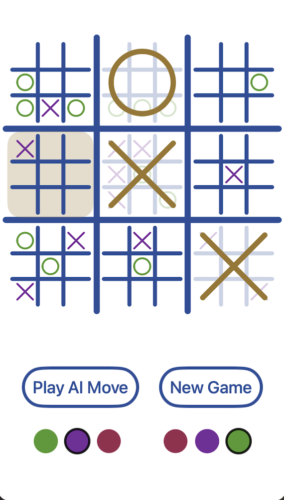

<h2 align="center"><i>Mega Tic-Tac-Toe</i></h2>

### Intro

Mega Tic Tac Toe is an iOS mobile app version of the game Ultimate Tic Tac Toe.
This game entails 2-player tic tac toe play, in a nested 3x3 board of tic tac toe boards.
The rules can be found online here: https://bejofo.net/ttt.

## Table of Contents
- [Installation](#Installation)
- [Usage](#Usage)
- [Credits](#Credits)

## Installation

### Mac

To download, clone the repo onto your computer. You will need [XCode](https://apps.apple.com/us/app/xcode/id497799835?mt=12) installed and an Apple Developer account.

`git clone https://github.com/juleswg23/MegaTicTacToe`

Connect an iPhone to your mac by USB and build the project in XCode with the target being your mobile device.
Run the app on your phone (you may need to trust the developer certificate on your iPhone).

## Usage 

Both single and local multi player game modes are supported in the app.
To play locally with another player, play and pass, alternating the turns by hand. 
To play with the computer, click any square to make your move, and then press the AI move button and wait for the computer to select a move.

### Bot Model

The computer moves are backed by a monte-carlo-tree-search to converge on an optimal move.
For more details on this algorithm, check out [this version I wrote](https://github.com/juleswg23/monte-carlo-tree-search) generalized for any mutliplayer turn-based strategy game.

## Credits

This project was made possible by [100 days of Swift](https://www.hackingwithswift.com/100) and my favorite [closure aid](https://fuckingclosuresyntax.com/).

